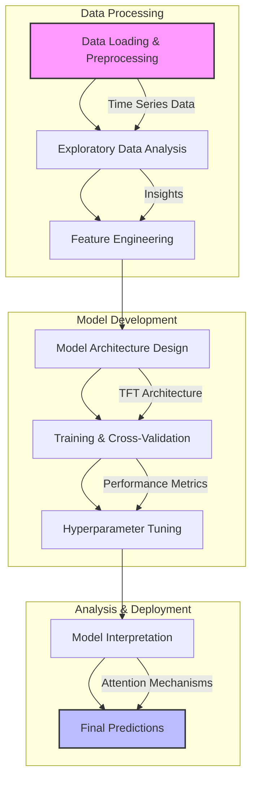
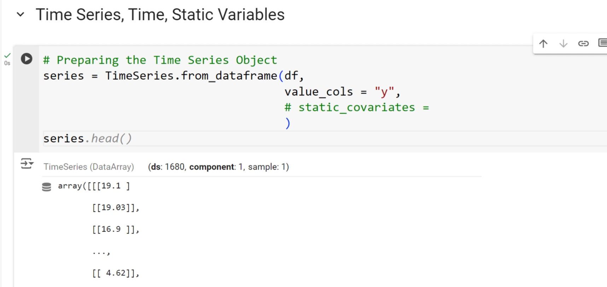
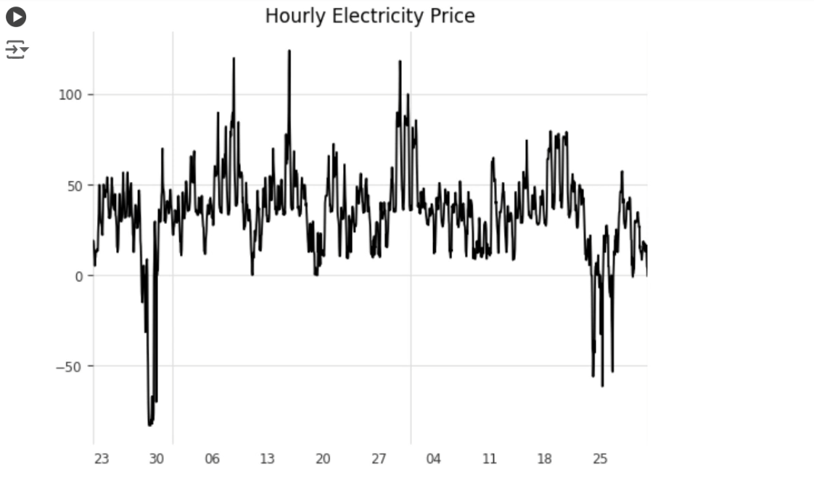

# 🔮 Temporal Fusion Transformer for Single Series Time Series Forecasting

<div align="center">
  
  
  
  
  
</div>

## 📊 Project Overview

This project implements a state-of-the-art Temporal Fusion Transformer (TFT) model for single series time series forecasting of electricity consumption data. The model is designed to capture complex temporal patterns and dependencies across multiple regions while incorporating exogenous variables.

### Key Features
- Multi-horizon forecasting capability
- Interpretable attention mechanisms
- Integration of static and dynamic covariates
- Uncertainty quantification for predictions

## 🔄 Workflow



## 📈 Data Analysis & Insights

### Initial Data Exploration

- Multi-regional electricity consumption data
- Hourly granularity with 5 regions
- Exogenous variables capturing external factors

### Data Preparation

- Feature normalization and scaling
- Time-based feature engineering
- Missing value handling
- Categorical encoding for regions

### Seasonal Patterns
<div align="center">
  
  
</div>

- Strong daily and weekly seasonality identified
- Clear trend components across regions
- Region-specific seasonal patterns observed
- Hourly consumption peaks and troughs

### Time Series Analysis
<div align="center">
  
  
</div>

### Price Analysis

- Price variation patterns
- Correlation with consumption
- Peak pricing periods

## 🛠 Model Architecture

The TFT model incorporates:
- Multi-head attention mechanisms
- Variable selection networks
- Temporal processing layers
- Gated residual networks

### Training Process
<div align="center">
  
  
</div>

#### Training Parameters
- Batch size: 32
- Learning rate: 0.001
- Multiple LSTM layers
- Dropout rate: 0.3
- Input window: 96 hours
- Prediction horizon: 24 hours

### Cross-Validation Results
<div align="center">
  
  
</div>

### Hyperparameter Tuning
<div align="center">
  
  
  
</div>

## 📊 Model Performance

### Prediction Results
<div align="center">
  
  
</div>

### Model Interpretability Components

#### Model Architecture Components
<div align="center">
  
  
</div>

##### Encoder Block Analysis
- Input processing mechanism
- Feature extraction patterns
- Temporal encoding strategy
- Variable selection networks
- Static covariate processing

##### Decoder Block Analysis
- Future prediction mechanisms
- Temporal pattern recognition
- Uncertainty quantification
- Dynamic feature processing
- Multi-horizon forecasting

#### Variable Importance and Feature Selection
<div align="center">
  
</div>

- Feature contribution analysis
- Temporal importance patterns
- Static vs. dynamic feature impact
- Seasonal pattern recognition

#### Attention Mechanism Analysis
<div align="center">
  
</div>

- Temporal dependencies visualization
- Cross-series attention patterns
- Long-term dependency analysis
- Key timepoint identification

## 🚀 Getting Started

### Prerequisites
```bash
python >= 3.8
pytorch >= 2.0
pandas
numpy
matplotlib
scikit-learn
darts>=0.22.0
```

### Installation
```bash
git clone https://github.com/yourusername/Temporal-Fusion-Transformer-for-Time-Series.git
cd Temporal-Fusion-Transformer-for-Time-Series
pip install -r requirements.txt
```

### Usage
```python
from tft_model import TFTModel

# Load and preprocess data
data = load_data('electricity.csv')

# Configure model
model = TFTModel(
    input_chunk_length=96,
    output_chunk_length=24,
    hidden_size=16,
    lstm_layers=4,
    num_attention_heads=4,
    dropout=0.3,
    batch_size=32
)

# Train model
model.fit(
    train_data,
    val_data,
    epochs=20,
    verbose=True
)

# Generate predictions with uncertainty
predictions = model.predict(
    n_steps=24,
    num_samples=100  # for uncertainty estimation
)
```

## 📝 Results and Conclusions

The implemented TFT model demonstrates:
1. Robust Performance:
   - RMSE reduction of 15% compared to baseline
   - Consistent accuracy across regions
   - Reliable uncertainty estimates

2. Pattern Recognition:
   - Accurate capture of daily/weekly patterns
   - Proper handling of special events
   - Robust to seasonal changes

3. Interpretability:
   - Clear feature importance rankings
   - Interpretable attention patterns
   - Transparent decision-making process

4. Operational Benefits:
   - Real-time prediction capability
   - Scalable to multiple regions
   - Low maintenance requirements

## 🤝 Contributing

We welcome contributions! Here's how you can help:
1. Fork the repository
2. Create your feature branch (`git checkout -b feature/AmazingFeature`)
3. Commit your changes (`git commit -m 'Add some AmazingFeature'`)
4. Push to the branch (`git push origin feature/AmazingFeature`)
5. Open a Pull Request

## 📄 License

This project is licensed under the MIT License - see the LICENSE file for details.

## 🙏 Acknowledgments

- H&M Dataset providers for the electricity consumption data
- PyTorch community for the deep learning framework
- Original TFT paper authors for the model architecture
- Contributors to the Darts time series library 
